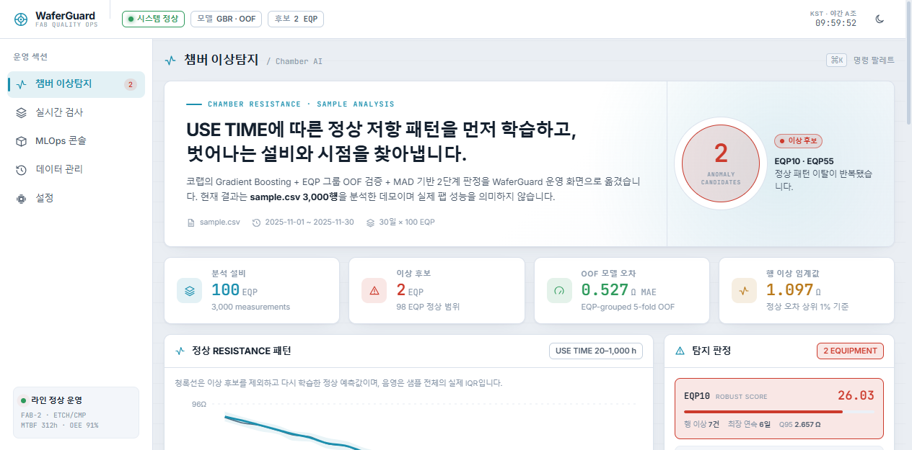

# WaferGuard

**반도체 Fab Quality Ops를 위한 멀티 에이전트 운영 보조 시스템**

WaferGuard는 반도체 공정 설비의 이상과 Wafer 품질 이상을 함께 모니터링하고, 공정 시계열·이미지·Metrology·과거 사례를 연결하여 이상 원인 후보와 대응안을 제안하는 Fab Quality Ops 데모 플랫폼입니다.

현재 저장소는 실제 Fab 설비를 직접 제어하는 시스템이 아니라, **샘플·프록시 데이터와 시뮬레이션을 이용해 운영 의사결정 흐름을 검증하는 구조**입니다. Lot lifecycle, Data Quality Gate, 실제 sklearn Expected Resistance 모델, MAD/EWMA detector, 검사·Agent 근거를 PostgreSQL에 연결하며, Vision 결과는 정적 스냅샷에서 선택한 근거를 기존 Inspection Agent 파이프라인으로 전달합니다.

## 📝 Overview

WaferGuard의 핵심은 결함을 단순히 분류하는 데서 끝내지 않고, 탐지 이후에 필요한 운영 판단을 하나의 워크플로로 묶는 것입니다.

```text
Fab Overview
        ↓
Process Monitoring / Etch anomaly
        +
Wafer Quality / Lot · Timeline · Defect Map
        ↓
POST /api/v1/inspect
        ↓
Risk + Metrology / Vision rules
        ↓
Inspection Agent + RAG + Action Card
        ↓
Human approval / review
        ↓
RAG knowledge feedback + MLOps delegation
```

### ⭐️ Key Features

- **Fab Overview**: 8대 공정 상태, Active Lot, connected equipment, warning/critical, 최근 이상 후보를 한 화면에서 표시합니다. 실제 값이 없는 공정은 `Demo profile`로 구분합니다.
- **Process Monitoring**: 25-wafer Lot lifecycle, wafer당 다중 telemetry, startup/hold/cleaning 상태, recipe/setpoint, RF, pressure, gas, temperature와 Actual/Expected residual을 함께 표시합니다.
- **Wafer Quality**: 검사 DB를 우선 사용하고 비어 있을 때 기존 Vision snapshot demo를 사용해 Lot 상태판, Wafer timeline, 누적 defect map, Wafer Detail을 제공합니다.
- **Vision Evidence**: `wafer_particle`의 저장된 통계/AI 비교 결과와 대표 히트맵을 독립 제품이 아니라 Wafer Detail의 proxy evidence로 사용합니다.
- **Data Quality / Detector Layer**: `VALID`만 예측·학습에 사용하고 `WARNING/REJECT`는 모델에서 차단합니다. MAD primary와 EWMA secondary 결과를 `anomaly_detections`에 보존합니다.
- **Process Event Layer**: Chamber anomaly를 기존 테이블에서 삭제하지 않고 `process_events`로 투영하여 같은 Lot·검사 이전 30분의 시간적 연관 후보를 조회합니다.
- **Inspection Agent**: LangGraph 기반 도구 호출 루프로 과거 사례와 공정 근거를 조회하고 추정 원인과 대응 방안을 제안합니다.
- **Human-in-the-Loop RAG**: 엔지니어 리뷰 중 `approved` 또는 `false_alarm`으로 확정된 사례만 RAG 지식으로 다시 저장합니다. 미확정 `needs_review` 상태는 학습 사례로 저장하지 않습니다.
- **MLOps Agent**: drift/model 상태를 확인하고 재학습 권고, 승인 요청, promote/rollback 시뮬레이션을 수행합니다. Inspection Agent에서 fleet-level 문제로 판단되면 MLOps Agent로 위임할 수 있습니다.
- **Approval Gate**: critical alert나 retraining 같은 high-risk tool action은 pending approval에 저장한 뒤 엔지니어 승인/거절로 처리합니다.
- **Data & RAG Console**: 검사 이력, Agent trace, approval, 모델/드리프트, RAG 문서 등 운영 DB를 읽어볼 수 있습니다.

## 🎯 Demo

### 🏭 Fab Overview / Process Monitoring



Etch Monitoring은 `Overview · Equipment · Process Trend · Anomaly · Model`로 구성되며, 기존 Resistance 화면의 두 모드를 보존합니다.

- **Live**: `configs/chamber.yaml`의 recipe/setpoint를 기준으로 여러 장비의 연속 telemetry를 생성합니다. `running`/`quality=good` row로 실제 sklearn pipeline을 bootstrap하고, Production model로 Expected Resistance와 residual/anomaly를 DB에 저장합니다.
- **Static Demo**: 기존 `DATE`, `EQP`, `USE_TIME`, `RESISTANCE` 3,000행 offline 분석과 EQP10/EQP55 결과를 그대로 유지합니다.

로컬 Live 데이터를 빠르게 만들려면 backend와 별도 터미널에서 실행합니다.

```bash
python scripts/run_chamber_stream.py --equipment-count 3 --interval 0 --samples 180
```

일반 실행은 `--interval 1`을 사용합니다. `--anomaly rf_power_drift --anomaly-after 140`처럼 원인 parameter 이상을 주입할 수 있습니다. 생성되는 range, coefficient, feature importance는 pipeline 검증용 synthetic 값이며 실제 Fab spec이나 물리 계수가 아닙니다.

기존 static JSON 재생성은 계속 지원합니다.

```bash
python scripts/build_chamber_dashboard_data.py --input "/path/to/sample.csv" --output "frontend/src/data/chamberSample.json"
```

### 🏗️ Virtual FAB Multimodal v2

Photo → Etch → Deposition → CMP를 Lot/Wafer/Process Run identity로 연결하고, 각 run의 FDC telemetry → Metrology → Inspection → late fusion → Candidate RCA를 같은 trace로 저장합니다. 기본 transport는 Mosquitto QoS 1이며 Direct는 빠른 개발 확인용입니다.

```powershell
# PostgreSQL + MQTT
docker compose up -d postgres mosquitto

# 기본: MQTT, 1 Lot × 1 Wafer × 4공정
python scripts/run_fab_stream.py --lots 1 --wafers-per-lot 1 --seed 42

# 빠른 골격 확인: CMP 한 공정, Direct transport
python scripts/run_fab_stream.py --lots 1 --wafers-per-lot 1 --process cmp --transport direct --seed 42

# latent fault는 지정 cycle 이후에만 주입
python scripts/run_fab_stream.py --lots 1 --wafers-per-lot 3 --process cmp `
  --fault cmp_slurry_degradation --fault-after-cycle 1 --seed 42
```

생성되는 계수·이미지·점수는 pipeline 계약 검증용 synthetic proxy입니다. 이번 v2는 재학습이나 최고 성능이 아니라 교체 가능한 데이터 흐름을 제공합니다. 실제 명령과 로컬 데이터/notebook 사용법은 [`docs/RUN_LOCAL.md`](docs/RUN_LOCAL.md), 전체 연결 구조는 [`docs/ARCHITECTURE.md`](docs/ARCHITECTURE.md)를 참고하세요.

### 🧭 Wafer Quality / Vision Evidence

`Wafer Quality`는 runtime inspection DB를 Lot/Wafer 단위로 집계합니다. 데이터가 없을 때는 `frontend/src/data/waferVisionSample.json`과 대표 이미지를 `Demo / Proxy`로 명시해 상태판·timeline·누적 map·상세 evidence를 구성합니다.

- 통계 방식: 픽셀 중앙값·MAD 기반 결과
- 정상 전용 AI: ResNet18 feature + PaDiM-style 결과
- 비교 모드: 두 방식의 **미리 계산된 결과 중 어떤 기준을 화면에 표시할지 전환**합니다. 현재 WaferGuard 프론트엔드 안에서 모델 추론을 실시간으로 다시 수행하지는 않습니다.
- 현재 스냅샷: 3,000 images / 100 chambers / 300×300 px
- 샘플 이상 챔버: CH-007, CH-047, CH-061
- 샘플 이상 이미지: 51장

Wafer Detail의 Vision Evidence에서 `Inspection Agent에 전달`을 누르면 통계/AI 점수, 방향, 시점, 이상 면적을 전용 `vision_*` 필드로 `POST /api/v1/inspect`에 보내고 최상위 `AI Analysis` 화면으로 연결합니다.

현재 Action Card의 Vision rule은 샘플 기준으로 다음 임계값을 사용합니다.

- 통계 `>= 2.0` + AI `>= 50.0`: Critical evidence
- 둘 중 하나만 위 기준 초과: Warning
- 통계 `>= 1.2` 또는 AI `>= 35.0`: Caution-level warning

이 값은 **실제 Fab spec/control limit가 아니라 현재 샘플용 임계값**입니다.

`wafer_particle` 분석 서버가 별도로 실행 중이라면 비교 결과와 대표 자산을 다시 생성할 수 있습니다.

```bash
python scripts/build_wafer_vision_dashboard_data.py --base-url http://127.0.0.1:<port> --dataset-id <dataset-id>
```

> `wafer_particle` 분석 서버 전체는 이 저장소에 포함되어 있지 않습니다. WaferGuard에는 생성된 결과 스냅샷과 대표 자산만 포함합니다.

### 🔎 Wafer Detail / Inspection


- `POST /api/v1/inspect`로 검사 건을 생성합니다.
- wafer map / heatmap / overlay / ROI와 공정·metrology 근거를 함께 저장합니다.
- Medium/High 리스크 케이스는 Agent 분석 및 review workflow로 연결됩니다.
- 검사 건별 Agent trace 조회, 재실행, 근거 기반 chat, SSE streaming을 지원합니다.

### 🤖 AI Analysis / Inspection Agent


- LangGraph 기반 Agent가 RAG와 도구를 사용해 검사 근거를 조회합니다.
- 과거 사례, metrology/vision rule hit, 같은 Lot의 인접 Wafer, 검사 이전 30분의 process event 후보를 바탕으로 Action Card와 권장 조치를 구성합니다.
- 엔지니어가 `approved` 또는 `false_alarm`으로 결론을 내린 사례는 다시 검색 가능한 지식으로 저장됩니다.

### 📈 MLOps


- 최상위 기본 화면은 실제 Chamber Production/Staging registry, DQ, MAD/EWMA, 장비·recipe·Lot holdout 지표와 학습 데이터 구간입니다.
- readiness가 충족되면 scheduler/stream이 Staging Candidate까지만 자동 학습하며 Production 승격은 명시적 사람 호출만 허용합니다.
- 기존 wafer 모델 registry, drift, MLOps Agent는 `Legacy / Demo` 탭의 workflow simulation으로 유지됩니다.
- high-risk action은 approval gate를 통과해야 실행됩니다.
- 자동화 tick은 `/api/v1/automation/tick`으로 실행하며 AWS에서는 Lambda + EventBridge로 호출할 수 있습니다.

## ✍️ Agentic Flow


> 위 다이어그램은 기존 Inspection/MLOps Agent 흐름을 설명합니다. 최신 Chamber Resistance/Vision AI는 이 흐름의 **상류 evidence source**로 연결됩니다.

## 🧑‍💻 Tech Stack

| 영역 | 현재 구현 |
|------|-----------|
| Backend | FastAPI · Pydantic · LangGraph StateGraph |
| LLM | GPT-4o-mini via Luxia Gateway · text/image 입력 · tool calling |
| RAG | Luxia embedding 1024-d · cosine search · rerank · DB BLOB embedding |
| Frontend | React 19 · Vite 7 · Recharts 3 |
| Runtime DB | 표준 로컬/운영 PostgreSQL 16 · 명시적 unit test/demo만 SQLite |
| Object Storage | 기본 local `outputs/` / `IMAGE_BACKEND=s3` 시 S3 |
| Workflow tables | Lot/Inspection/RAG/Agent workflow 11개 + Chamber 4개 = 15개 |
| Chamber ML | pandas · scikit-learn Pipeline/GradientBoosting · joblib · PyYAML |
| AWS integration | boto3 · S3 · RDS · Secrets Manager · SNS · Lambda/EventBridge |

## 🛜 AWS Deployment

WaferGuard는 로컬 PostgreSQL·로컬 object storage 구성을 표준으로 두고, 환경변수로 RDS/S3 backend를 선택할 수 있습니다.


| AWS 서비스 | 역할 | 코드 연결 |
|------------|------|-----------|
| **EC2** | FastAPI + production frontend 실행 | `app.main` / `frontend/dist` |
| **S3** | 이미지·CSV·PDF object storage | `app/services/object_store.py` |
| **RDS (PostgreSQL)** | workflow DB | `app/services/db.py` |
| **Secrets Manager** | 환경 secret 로딩 | `app/services/config.py`, `app/services/aws.py` |
| **SNS** | high-risk alert fan-out | `app/services/aws.py` + alert workflow |
| **CloudWatch** | 배포 환경 로그/메트릭 관찰 | uvicorn/AWS 운영 구성 |
| **Lambda + EventBridge** | 주기적인 automation tick 호출 | `infra/lambda/automation_tick.py` |

상세 배포 절차는 [`docs/AWS_Deploy_Guide.md`](docs/AWS_Deploy_Guide.md), 마이그레이션 및 비용 관련 내용은 [`docs/`](docs/)의 AWS 문서를 참고하세요.

## Prerequisites

| 도구 | 권장/최소 버전 |
|------|-----------|
| Python | 3.11 |
| Node.js | **20.19+ 또는 22.12+** (현재 Vite 7 기준) |
| npm | 위 Node.js 설치에 포함된 최신 npm 권장 |

## Local Demo Guide

### 1. Clone & Install Backend Dependencies

```bash
git clone https://github.com/arnold6444/WaferGuard.git
cd WaferGuard

conda create -n waferguard python=3.11 -y
conda activate waferguard
pip install -r requirements.txt
```

### 2. Install Frontend Dependencies

```bash
cd frontend
npm install
cd ..
```

### 3. Start PostgreSQL and Configure Runtime

PostgreSQL backend 선택은 필수이며 연결에 실패해도 SQLite로 자동 fallback하지 않습니다.

```powershell
Copy-Item .env.example .env
docker compose up -d postgres mosquitto
docker compose ps
```

호스트 5432가 이미 사용 중이면 `.env`의 `POSTGRES_PORT`와 `RDS_PORT`를 모두 `5433`으로 변경합니다. SQLite는 unit test나 가벼운 명시적 demo에서만 `STORAGE_BACKEND=sqlite`로 선택합니다.

### 4. Configure LLM Access (optional)

실제 Luxia LLM 호출을 사용하려면 프로젝트 루트에 `.env`를 만듭니다.

```bash
LUXIA_API_KEY=발급받은_키
```

`LUXIA_API_KEY`가 없어도 앱은 기동되며, Luxia client는 stub/fallback 경로를 사용합니다. 실제 Agent LLM 응답을 확인하려면 API 키가 필요합니다.

### 5. Configure Frontend API URL

`frontend/.env.local`을 만들면 Windows PowerShell/bash 구분 없이 같은 방식으로 실행할 수 있습니다.

```bash
VITE_API_BASE_URL=http://127.0.0.1:8000
```

### 6. Run Backend & Frontend

**터미널 1 — Backend**

```bash
conda activate waferguard
uvicorn app.main:app --host 127.0.0.1 --port 8000
```

**터미널 2 — Frontend**

```bash
cd frontend
npm run dev
```

**터미널 3 — Virtual FAB stream (선택, 기본 MQTT)**

```bash
python scripts/run_fab_stream.py --lots 1 --wafers-per-lot 1 --seed 42
```

기존 Etch 전용 Chamber stream도 계속 사용할 수 있습니다.

```bash
python scripts/run_chamber_stream.py --equipment-count 3 --interval 1
```

접속 주소:

```text
Dashboard : http://127.0.0.1:5173
API docs  : http://127.0.0.1:8000/docs
Health    : http://127.0.0.1:8000/health
```

현재 `/health` 응답:

```json
{"status":"ok","service":"waferguard-api","database":{"backend":"postgres","status":"connected"},"fab":{"database_backend":"postgres","transport":{}}}
```

### 7. Synthetic Fab Scenario

Generator와 Inspection은 직접 의존하지 않으며 별도 orchestrator가 wafer completion과 검사 lag를 연결합니다.

```bash
python scripts/run_fab_scenario.py --wafer-samples 4 --lag-minutes 5
```

이 시나리오는 W13~W15에 RF drift와 Edge-Loc 검사 열화를 함께 생성하지만, 시간적 연관을 실제 인과관계로 주장하지 않습니다.

### 8. Smoke Test & Build

`smoke_test.py`는 실행 중인 서버에 HTTP 요청을 보내는 방식이 아니라 **FastAPI `TestClient`로 앱을 직접 import해서 검사**하므로 백엔드 서버를 따로 띄워둘 필요가 없습니다.

```bash
conda activate waferguard
python scripts/smoke_test.py

cd frontend
npm run build
```

## 주요 API

| Method | Endpoint | 역할 |
|--------|----------|------|
| GET | `/health` | DB + FAB ingestion/detection 상태 |
| POST | `/api/v1/inspect` | 검사 생성 + risk/action card + agent workflow |
| GET | `/api/v1/inspections` | 최근 검사 목록 |
| GET | `/api/v1/inspect/{id}/trace` | 검사 Agent trace |
| POST | `/api/v1/inspect/{id}/chat/stream` | 검사 근거 기반 streaming chat |
| POST | `/api/v1/review/{id}` | 엔지니어 review + 확정 사례 RAG 저장 |
| GET/POST | `/api/v1/automation/status`, `/api/v1/automation/tick` | 자동화 상태/실행 |
| GET | `/api/v1/rag/search` | 과거 사례 검색 |
| GET | `/api/v1/db/overview` | workflow DB 개요 |
| GET | `/api/v1/fab/overview` | runtime + demo 출처를 포함한 Fab Overview read model |
| GET | `/api/v1/fab/equipment` | FAB equipment/unit/recipe inventory |
| GET | `/api/v1/fab/wafers/{wafer_id}/trace` | Wafer의 전체 공정 route와 multimodal evidence |
| GET | `/api/v1/fab/process-runs/{process_run_id}` | Process Run telemetry/metrology/inspection/fusion 상세 |
| GET | `/api/v1/process/{process_id}/live` | process/equipment/unit/recipe별 live read model |
| GET | `/api/v1/fab/rca/{process_run_id}` | Candidate root cause와 evidence |
| GET | `/api/v1/fab/metrics` | MQTT/DB/latency/anomaly/model version 지표 |
| GET | `/api/v1/fab/analysis/latest` | 로컬 notebook/CLI 분석 요약(feature importance/correlation) |
| GET | `/api/v1/process/profiles` | 8대 공정 parameter/profile metadata |
| GET | `/api/v1/process/events` | 공통 process event와 시간 범위 조회 |
| GET | `/api/v1/lots` | Lot 원장/status 조회 |
| GET | `/api/v1/quality/lots` | 검사 DB의 Lot 요약 |
| GET | `/api/v1/quality/lots/{lot_id}` | Wafer timeline/detail 집계 |
| GET | `/api/v1/chamber/status` | warm-up/Production/readiness 상태 |
| GET | `/api/v1/chamber/equipment` | 장비별 최신 상태 |
| GET | `/api/v1/chamber/telemetry` | Chamber telemetry 조회 |
| GET | `/api/v1/chamber/predictions` | Actual/Expected/residual/anomaly 조회 |
| GET | `/api/v1/chamber/detections` | MAD/EWMA detector별 결과 조회 |
| GET | `/api/v1/chamber/models` | Chamber model registry |
| POST | `/api/v1/chamber/retrain` | readiness gate 후 실제 Candidate 학습 (`force=true` demo override) |
| POST | `/api/v1/chamber/models/{version}/promote` | artifact 검증 후 명시적 Production 승격 |
| GET | `/api/v1/mlops/state` | MLOps 상태 |
| POST | `/api/v1/mlops/agent/run` | MLOps Agent 실행 |
| POST | `/api/v1/mlops/drift` | drift 시뮬레이션 |
| POST | `/api/v1/mlops/retrain` | retraining 시뮬레이션 |
| POST | `/api/v1/models/promote` | staging model promote |
| POST | `/api/v1/models/rollback` | model rollback |
| GET | `/api/v1/pending-approvals` | 승인 대기 action 목록 |

전체 API 계약은 실행 후 FastAPI Swagger(`/docs`)에서 확인할 수 있습니다.

## Project Structure

```text
app/
  main.py                    # FastAPI routes + frontend dist mount
  services/
    schemas.py               # Pydantic request models
    pipeline.py              # POST /api/v1/inspect 핵심 흐름
    risk.py                  # risk score / level
    action_card.py           # metrology + vision rules / Action Card
    agent.py                 # Inspection/MLOps LangGraph agent
    tools.py                 # Agent tool registry
    rag.py                   # RAG index / case retrieval
    defect_chat.py           # inspection chat + SSE streaming
    mlops.py                 # drift/retrain/promote/rollback simulation
    chamber_generator.py     # stateful multivariate Etch simulator
    chamber_storage.py       # Chamber telemetry/prediction/model DB access
    chamber_training.py      # sklearn fit/evaluation/joblib artifact
    chamber_runtime.py       # warm-up/inference/retrain/promote lifecycle
    chamber_data_quality.py  # VALID/WARNING/REJECT + aggregate events
    fab_scenario.py          # Generator → inspection 분리 orchestration
    fab_generator.py         # 4공정 Virtual FAB + lifecycle/fault propagation
    fab_mqtt.py              # QoS 1 MQTT/direct 공통 transport router
    fab_storage.py           # v2 additive schema/read model/consumer receipt
    fab_detection.py         # signed detector output + context fallback
    fab_models.py            # 외부 학습 artifact 계약 검증 + Staging 등록
    fab_fusion.py            # calibrated late fusion
    fab_rca.py               # persisted evidence-only Candidate RCA
    fab_orchestrator.py      # Lot/Wafer route → transport → fusion/RCA
    process_ops.py           # process profile/event/Fab/Quality read model
    automation.py            # periodic automation tick
    storage.py               # workflow persistence / DB browser
    db.py                    # SQLite ↔ PostgreSQL abstraction
    object_store.py          # local outputs ↔ S3 abstraction
    luxia_client.py          # Luxia chat/embedding/rerank client
    aws.py                   # AWS clients
    synthetic_wafer.py       # wafer map / heatmap / ROI generation
  data/                      # RAG/evaluation fixture + WM-811K subset

frontend/
  src/App.jsx                # 7개 Fab Quality Ops navigation
  src/FabOverview.jsx
  src/ProcessMonitoring/     # Etch full detail + 7 demo profiles
  src/WaferQuality/          # Lot/Grid/Timeline/Defect Map/Detail
  src/AIAnalysis/            # 기존 Inspection Agent 통합 화면
  src/ChamberView.jsx        # 보존된 Live/Static Resistance 분석
  src/WaferVisionView.jsx    # Wafer Detail vision evidence + Agent handoff
  src/InspectionWorkspace.jsx
  src/MlopsWorkspace.jsx
  src/DatabaseView.jsx
  src/SettingsView.jsx
  src/data/chamberSample.json
  src/data/waferVisionSample.json

scripts/
  smoke_test.py
  build_wm811k_subset.py
  build_chamber_dashboard_data.py
  run_chamber_stream.py
  run_fab_scenario.py
  build_wafer_vision_dashboard_data.py

infra/
  lambda/automation_tick.py

docs/
  spec.md
  decisions.md
  progress.md
  AWS_*.md

outputs/                     # local runtime DB/images/reports (gitignore)
runtime/models/chamber/      # fitted Chamber pipeline artifacts (gitignore)
```

## 현재 구현 경계

- Fab Overview는 Etch/Inspection runtime 값이 있으면 사용하고, 연결되지 않은 공정은 명시적인 `Demo profile` 상태를 사용합니다.
- Chamber Resistance Live는 synthetic Lot/Wafer lifecycle, 엄격한 DQ gate, 실제 sklearn fit/inference, MAD/EWMA, Staging/Production lifecycle을 연결합니다. 자동 흐름은 Candidate를 승격하지 않습니다.
- 기존 CSV 기반 `USE_TIME` 분석은 Static Demo로 유지됩니다.
- Wafer Quality는 inspection DB를 우선 사용하며, rich demo가 필요할 때 **외부 `wafer_particle` 분석 결과의 정적 스냅샷**을 명시적인 proxy dataset으로 사용합니다.
- Vision 결과를 Inspection Agent로 넘기는 API 연동은 구현되어 있습니다.
- `process_events`와 Wafer의 관계는 **같은 Lot을 우선한 검사 이전 30분의 시간적 연관 후보**이며 인과관계 주장이 아닙니다.
- 실제 설비 연결, 실제 Fab control limit, 자동 장비 제어, production 성능 보장은 현재 범위가 아닙니다.
- 기존 wafer MLOps retrain/promote/rollback은 workflow 시뮬레이션이고, Chamber retrain은 별도 registry/artifact를 쓰는 실제 sklearn 학습입니다.
